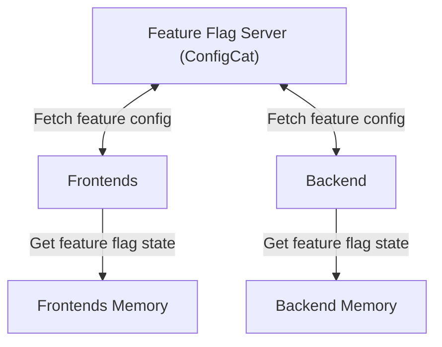
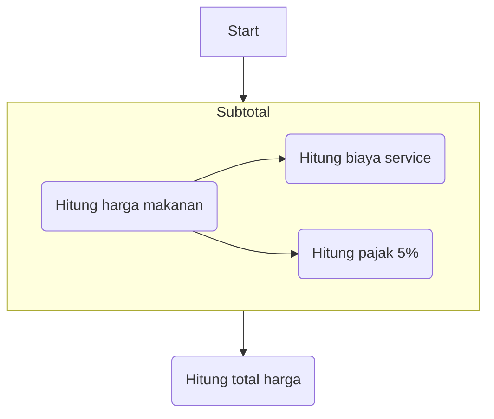
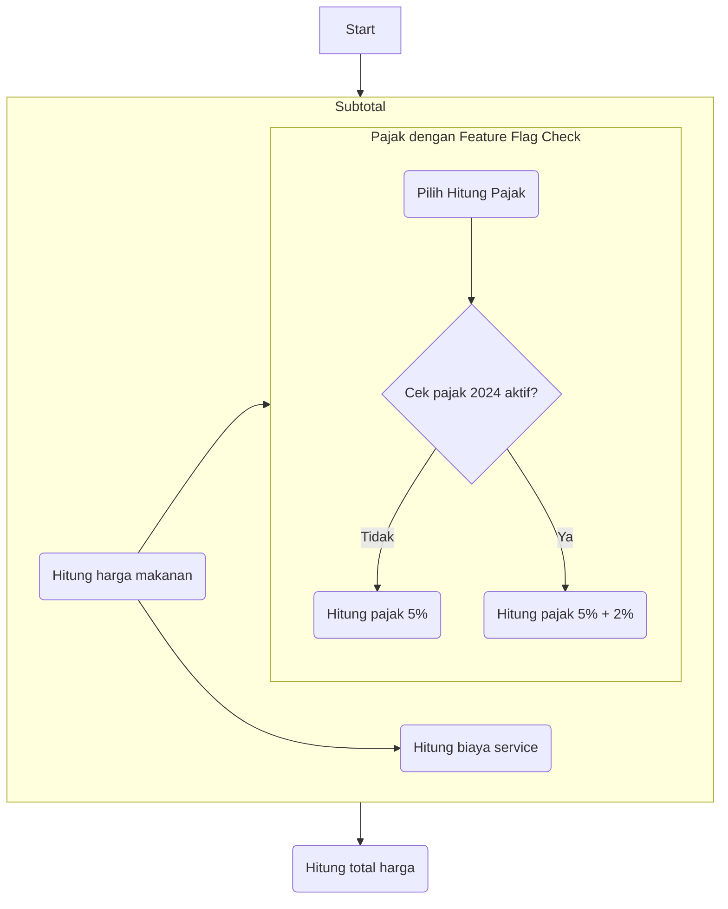

# Feature Flag Demo with ConfigCat

- [ConfigCat](https://configcat.com/) adalah salah satu solusi untuk manajemen feature flag.
  - Saya pilih ini karena configcat termasuk yang paling mudah dipakai, selain UI nya yang bagus, 
    fitur dan dokumentasinya juga sangat mudah dimengerti.
  - Server ConfigCat pun sangat mudah, karena cukup signup maka kamu langsung bisa pakai di CDN server nya.
- Contoh lainnya adalah: 
  - [Posthog](https://posthog.com/) lebih kaya di fitur-fitur nya, bisa hosting sendiri
  - [Flagsmith](https://www.flagsmith.com/)
  - [Unleash](https://www.getunleash.io/) 

## Apa itu feature-flag

Feature flag itu hanya sebuah toggle on/off buat fitur aplikasi, yang biasanya merupakan fitur baru. 
Jadi misal fitur UI baru bisa di switch on/off kapan saja.
Mungkin kalian pernah mengalami layout di facebook tiba2 berubah
di teman kalian tapi waktu kalian cek di tempat kalian, dia belum berubah layout nya.

Lalu setelah berapa hari tiba-tiba semua orang kembali ke layout lama.
Selain dengan sistem "Canary Deployment" hal itu juga bisa dilakukan dengan memakai feature flag.
Jadi fitur mu bisa hotswitch dan dikontrol oleh aplikasi.

### Flowchart

## Usecase

### Initial Application

Kita memiliki aplikasi untuk menghitung harga penjualan makanan di restaurant.
Aplikasi itu akan menghitung harga subtotal makanan + biasa servis + pajak.

#### Initial Flowchart:

### Request Changes

Perhitungan pajak akan berubah pada tahun 2024.
Rollout perubahan perhitungan pajak harus smooth dan bisa di rollback kapan saja.

#### _Quiz Time_

_Bila ini aplikasi dengan model OOP, 
design pattern apa yang dipakai untuk pemilihan fitur di atas?_